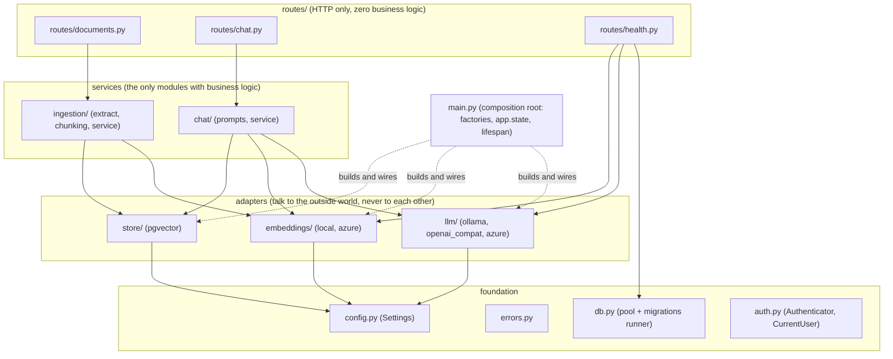

# Architecture

This document records how sovereign-rag is structured and **why**: every decision that a
reviewer might challenge is written down with its context, the decision, and its consequences.
The compliance view (data residency, ISO 27001, nLPD, LIPAD) lives in
[COMPLIANCE.md](COMPLIANCE.md); the contributor workflow (including "add an LLM provider in 30
minutes") lives in [CONTRIBUTING.md](CONTRIBUTING.md).

## 1. System overview

One Python package (`sovereign_rag`), one React frontend, one PostgreSQL database. Two flows:

- **Ingestion:** upload → extract text (pypdf / python-docx / stdlib) → chunk (per-type
  strategies, zero dependencies) → embed in batches → insert the chunk batch atomically, then
  flip the document to `ready`. Retrieval only ever sees `ready` documents, so a half-ingested
  document is never visible; a boot-time sweep marks interrupted jobs as `failed`.
- **Chat:** authenticate → embed the query → hybrid search (vector + full-text, RRF-fused in one
  SQL statement) → build the prompt with numbered context blocks → stream the answer over SSE →
  persist the assistant message with its source snapshot and metrics in a `finally` block.

Module-level view (same diagram style as the README, one level deeper):



(`/readyz` pings the database directly through the connection pool and calls the LLM and
embedding healthchecks; every arrow above is a runtime dependency, wired once by `main.py`.)

There are no hexagonal layers (`domain/infra/application`): at ~2 700 lines of Python that would
be pure indirection. The separation that earns its keep is **routes vs services vs adapters**.

## 2. The dependency rule

```
routes  →  services  →  adapters  →  config / errors
```

- Never the inverse: an adapter never imports a service, a service never imports a route.
- Never laterally between adapters: `store/` does not know `embeddings/` exists (the caller
  embeds the query and hands the vector to the store), `llm/` does not know `store/` exists.
- The **only** place that chooses a concrete implementation is `main.py`, through the three
  factories (`get_llm_client`, `get_embedding_client`, `get_vector_store`). Routes and services
  see only the Protocols.

The rule is enforced in review, not by an import linter: the one critical case, no `azure*`
import outside the Azure adapters, is locked down by two *executable* mechanisms (see section
4), and a one-sentence rule does not need a third.

## 3. Decision records

### 3.1 pgvector over dedicated vector databases

**Context.** Hybrid retrieval needs a vector index and full-text search over the same corpus.
Dedicated engines (Qdrant, Weaviate, Azure AI Search) do this well but add a second stateful
service, a second backup story, and a second security perimeter, against a target corpus of
thousands, not billions, of chunks.

**Decision.** PostgreSQL + pgvector is the only Phase 1 store. Documents, chunks, vectors,
conversations, and messages live in one database; the chunk batch of a document is inserted in
a single transaction, and both retrieval legs filter on `documents.status = 'ready'`, so a
partially ingested document is never retrievable.

**Consequences.** One backup, one connection pool, one security perimeter, and HNSW recall that
is more than sufficient below ~1 M vectors. The `VectorStore` Protocol plus its contract test
suite keep the door open: the README documents how to add a Qdrant or Azure AI Search adapter.

### 3.2 No Kubernetes

**Context.** The project promises a working system in minutes on a laptop; the target is a
single-instance pilot, not a fleet.

**Decision.** docker-compose is the only orchestration. The images are 12-factor (configuration
via environment, stateless API, healthchecks, non-root), so they run unchanged on AKS or any
other orchestrator later.

**Consequences.** No Helm charts or manifests to maintain in Phase 1; Phase 4 deploys the same
images to Azure with Terraform. What is lost (self-healing, rolling deploys) is not needed for
a single-instance pilot.

### 3.3 Provider abstraction via environment + Protocols

**Context.** The sovereignty pitch is "swap LLM, embeddings, or store without touching the
code". Inheritance-based plugin systems force adapters to import a base class and couple them to
the core.

**Decision.** Structural typing: each seam is a `typing.Protocol` (`LLMClient`,
`EmbeddingClient`, `VectorStore`, `Authenticator`). Selection happens via a `Literal`-typed
environment variable; each factory does a `match` with lazy imports per branch and
`assert_never` for exhaustiveness.

**Consequences.** Adapters import nothing from each other and nothing from services; pyright
verifies conformance at usage sites and flags a non-exhaustive `match` the moment a new provider
value is added to the `Literal`, which is exactly the walkthrough in CONTRIBUTING.md (its
condensed version lives in the `sovereign_rag/llm` factory docstring). Lazy imports keep
optional SDKs (torch, azure-identity) out of profiles that do not use them.

### 3.4 No ORM and no Alembic

**Context.** The knowledge this template transmits *is* SQL: reciprocal rank fusion, HNSW
tuning, generated tsvector columns, the `<=>` operator. An ORM would wrap all of it in sessions
and a unit of work for what is otherwise trivial CRUD. Without an ORM, Alembic loses
autogenerate: only its execution machinery would remain.

**Decision.** psycopg3 async with raw SQL as named module-level constants; migrations are
numbered `.sql` files applied by a ~40-line runner (a `schema_migrations` table, lexicographic
order, one transaction per file, `pg_advisory_lock` against concurrent boots).

**Consequences.** Every query is visible, reviewable, and tested against a real PostgreSQL in
CI. Schema changes are deliberate, hand-written files. The runner is readable in two minutes,
and that is the point. The trade-off is accepted: no autogenerate, and reviewers who equate
"production-grade" with "SQLAlchemy + Alembic" will want to read this section.

### 3.5 multilingual-e5-small default, bge-m3 upgrade path

**Context.** `compose up` must finish in minutes. bge-m3 is the better model but weighs 2.3 GB;
`intfloat/multilingual-e5-small` weighs ~450 MB, embeds FR/DE/EN well at 384 dimensions, and is
fast on CPU.

**Decision.** e5-small is the frozen default; its asymmetric `query:` / `passage:` prefixes are
handled inside the local adapter via a per-model-family prefix table (bge-m3 is already in the
table, with no prefixes). The README documents the bge-m3 upgrade: change `EMBEDDING_MODEL` and
`EMBEDDING_DIMENSIONS`, apply a `vector(1024)` migration, re-ingest the corpus.

**Consequences.** Fast first boot and a slim image. Because switching models silently would
corrupt retrieval, two guards exist: the `embedding_config` singleton row is checked at boot
(mismatch = refusal to start), and each document is stamped with `embedding_model` at ingestion.
The upgrade is now paved and measured rather than hypothetical: bge-m3 plus the reranker lifts
MRR from 0.717 to 0.784 on the stratified evaluation set and takes the cross-lingual stratum
from 0.15 to 0.84, at the cost of ~2.3 GB of image and markedly slower CPU embedding; the
shipped `migrations/optional/upgrade_bge_m3_1024.sql` and the `BAKED_EMBEDDING_MODEL` build
argument make the switch a documented operator action, and e5-small stays the default for the
boot-fast local demo.

### 3.6 Ollama native API over its OpenAI-compatible endpoint

**Context.** Reasoning builds of the qwen3 family emit `<think>` blocks that would ruin
first-token latency. The default demo model is the instruct build (`qwen3:4b-instruct`), which
has no thinking mode, but the adapter must keep that guarantee when an operator points
`OLLAMA_MODEL` at a reasoning build. Ollama's OpenAI-compatible endpoint exposes neither the
`think` flag nor `keep_alive`.

**Decision.** The Ollama adapter speaks the native `/api/chat` API over httpx, sending
`think: false` and `keep_alive` so the model stays warm between questions.

**Consequences.** Clean control of the two flags that make the local demo responsive, plus a
pedagogical bonus: two different transports (httpx vs the openai SDK) behind the same Protocol
prove the abstraction is real. The native API is not a standard; the contract suite with
recorded request/response shapes pins the expected format, and the `openai_compatible` adapter
remains a functional fallback for Ollama (degrading `think`).

### 3.7 Tri-config concatenated tsvector over per-document language detection

**Context.** The corpus is FR/DE/EN. Per-language tsvector configs require detecting the
language of every document (a dependency) *and* of every query (unreliable on five words).

**Decision.** One generated STORED column:
`to_tsvector('french', content) || to_tsvector('german', content) || to_tsvector('english', content)`.
The query side does NOT mirror it naively; see 3.13.

**Consequences.** Zero application code, zero language-detection dependency, and an index that
cannot desynchronize from the content. Measured costs on a 9k-chunk FR/DE/EN legal corpus: +59%
lexemes over a single config (114 vs 72 on a reference text), and each concept repeated at three
artificially spread positions, which inflates `ts_rank_cd` (~+60% on identical text) by eroding
the cover-density signal it relies on. The killer, though, sat on the query side: no config
strips another language's stopwords, so feeding a raw French question to the three
`websearch_to_tsquery` calls made `sont`, `les`, `de` mandatory lexemes under the german and
english configs, and the AND conjunction matched nothing. On every sentence-shaped question the
lexical leg returned 0 of 40 candidates; hybrid search was running on one leg. 3.13 records the
fix. This remains the most debatable choice in the design, and it is owned as such.

### 3.8 RRF fused in SQL, inside the store

**Context.** Reciprocal rank fusion could run in Python above two separate searches.

**Decision.** One SQL statement in the pgvector store: a vector CTE and a full-text CTE, each
producing per-leg ranks, fused with `FULL OUTER JOIN` and the RRF formula
(`1/(rrf_k + rank)`), ordered and limited server-side.

**Consequences.** One database round-trip. The interface stays at the right altitude ("the k
best chunks"), so callers never juggle two result lists. The Phase 2 ACL predicate applies
*inside each CTE, before fusion*: filtering after fusion would waste candidates and leak rank
information. And stores with native hybrid fusion (Qdrant, Azure AI Search) keep using it behind
the same Protocol, which a Python-side fusion would forbid.

### 3.9 ACL as a WHERE-clause predicate over Row-Level Security

**Context.** Phase 2 adds per-document permissions. PostgreSQL RLS with a shared async pool
requires per-transaction role or setting switches and makes isolation tests indirect. This
decision is taken now because it freezes the `hybrid_search` signature: it accepts `user_id`
from Phase 1 (carried, not yet enforced, but documented in the Protocol and in COMPLIANCE.md).

**Decision.** A single helper, `acl_predicate()`, generates an `EXISTS (...)` fragment against
`document_permissions`, applied in each retrieval leg (Roadmap, Phase 2; the two CTEs already
carry the insertion-point comments).

**Consequences.** The access rule is visible in the query, unit-testable with two-principal
leakage tests, and explainable to an auditor who does not know PostgreSQL internals. RLS remains
available to operators as optional defense in depth (see COMPLIANCE.md), but the application
does not depend on it.

### 3.10 In-process ingestion over a queue

**Context.** A Celery/queue stack would roughly double the moving parts of a single-instance
template.

**Decision.** Uploads return 202 immediately (200 with the existing row when the same bytes
were already ingested, by sha256 idempotency); processing runs in an `asyncio.create_task`,
with document status (`processing` / `ready` / `failed`) persisted in the database and a
boot-time sweep that marks interrupted jobs as `failed`.

**Consequences.** A restart kills in-flight jobs, mitigated by the sweep and by trivial
re-upload (ingestion is idempotent by sha256). Heavy embedding work runs in threads to keep the
event loop responsive. The evolution path is localized: a `jobs` table plus a separate worker
process, with no schema change to the Phase 1 tables.

### 3.11 SSE over WebSockets

**Context.** Chat streaming is strictly unidirectional: the client sends one POST, the server
streams events back.

**Decision.** Server-Sent Events over a plain HTTP response: named events
(`start`, `sources`, `delta`, `done`, `error`) plus a `: ping` comment every 15 seconds.

**Consequences.** No connection upgrade, so every proxy and load balancer cooperates (nginx just
needs `proxy_buffering off`); the stream is debuggable with curl; the heartbeat keeps idle
intermediaries from cutting the connection. Client aborts surface as disconnects, and the server
persists the partial answer with `error_code='client_disconnect'`, so nothing escapes the audit
trail. This last property took real engineering: once the client is gone, the ASGI stack
re-delivers cancellation at every `await`, so an unshielded INSERT in the `finally` block would
itself be cancelled and the audit row silently lost. The service therefore persists the
assistant message as a shielded task waited to completion, and the route drains the generator
before tearing the response down; a regression test re-delivers the cancellation to prove the
row still lands. WebSockets would buy bidirectionality nobody needs here.

### 3.12 Metrics from audit tables over Prometheus/Grafana

**Context.** The Phase 2 dashboard needs p50/p95 latencies, token counts, and the zero-result
rate. A metrics stack (Prometheus, Grafana, exporters) is two more services and a scrape
pipeline.

**Decision.** Every assistant message carries typed columns from Phase 1: `prompt_tokens`,
`completion_tokens`, `retrieval_ms`, `generation_ms`, `error_code`, `request_id`. The Phase 2
dashboard is SQL over these columns (plus `audit_log` and `message_feedback` once they exist).

**Consequences.** Zero new infrastructure, and the metrics are join-able with the audit trail by
`request_id`, a property Prometheus counters cannot offer. Prometheus/Grafana is documented as
the production evolution path once the system goes multi-instance.

### 3.13 Query-term selection with a strict pass and a relaxed fallback

**Context.** With the tri-config column of 3.7, mirroring the query through three
`websearch_to_tsquery` calls silently killed the lexical leg (0/40 candidates on any
sentence-shaped question: each config ANDs the other two languages' stopwords). Relaxing the
whole query to OR was measured and rejected: on a 9k-chunk corpus with a 119-question stratified
golden set it flooded the fusion with weak matches (MRR 0.878 -> 0.761 on the historical
stratum), and no down-weighting recovered it, exactly as the RRF window arithmetic predicts at
`rrf_k=60`.

**Decision.** The store reduces the question to informative terms before building any tsquery,
entirely in SQL (one round trip preserved): tokens that survive stopword filtering under ALL
three configs (drops the cross-language stopword leak), minus a fixed stoplist of FR/DE/EN
interrogatives and modals (measured: `quel` carried the highest IDF of an entire question, so a
pure rarity gate would promote interrogatives instead of dropping them), minus terms whose every
known lexeme sits above a document-frequency ceiling (15% of the corpus, from the `lexeme_df`
materialized view; the band is exclusion-only, so absent or stale statistics widen the filter
and can never silence the leg). The selected terms run as a strict AND per config first; only
when the strict pass matches nothing does a relaxed OR fallback run, floored at 60% of its own
best score: better zero lexical candidates than forty arbitrary ones. Fusion applies a
configurable lexical weight (`RRF_WEIGHT_FTS`) and a per-document cap
(`FUSION_PER_DOCUMENT_CAP`), because on a parallel multilingual corpus the top-k otherwise fills
with near-identical chunks of one document (measured: 7 of 8).

**Consequences.** On the stratified golden set, hit@8 rises from 90/119 to 97/119 and the
lexical leg contributes to 60% of returned sources instead of 3%, with MRR up (+0.013); the
rare-term stratum (acronyms, article numbers) reaches 17/17 at hit@8. Calibration on the same
set kept the defaults `rrf_k=60`, `w_fts=1.0`: every lower weight, and `rrf_k=20`, dropped
hit@8 back to 90. The term selection adds three cheap CTEs to the one query, and `lexeme_df` is
refreshed opportunistically (after each ingestion, at boot), never on the query path.

### 3.14 In-process cross-encoder reranking over the fused pool

**Context.** RRF ranks by leg agreement, not by joint query-passage relevance: the fused order
is good at recall and mediocre at precision. Cross-encoder rerankers are the largest single
quality lever in the retrieval literature, but the common deployment paths violate this
project's constraints: rerank-as-a-service adds a stateful dependency, Ollama does not expose
classification heads, and the llama.cpp `/v1/rerank` route returns degenerate scores for these
models.

**Decision.** An optional precision stage behind a `Reranker` Protocol, selected like every
other provider (`RERANKER_PROVIDER`, `none` by default so the core profile boots without the
local extra; the shipped compose stack enables `local`). The local adapter runs
`cross-encoder/mmarco-mMiniLMv2-L12-H384-v1` in-process over ONNX Runtime, with two measured,
non-negotiable choices: the execution provider is pinned to `CPUExecutionProvider` (the CoreML
provider onnxruntime picks by default on Apple Silicon crashes some rerankers and slows
others), and the graph-optimized fp32 export is used instead of int8 (dynamic int8 is slower
than fp32-O3 on ARM; the published 3x speedups are AVX512-VNNI numbers). With a reranker
active, the chat service over-fetches `RERANKER_CANDIDATES` (40) fused candidates and the
cross-encoder keeps the top 8; the weights are baked into the image like the embedding model,
so the offline guarantee of the local profile is unchanged.

**Consequences.** On the stratified golden set (119 questions, 9k-chunk corpus): hit@1 71 ->
78, hit@8 97 -> 100, MRR 0.675 -> 0.717, with a measured median latency of 144 ms per query
(max 407 ms) on CPU. The reranker is bounded by the pool it is given: it cannot recover what
the fused query missed, which is why the lexical-leg work of 3.13 precedes it and why
`RERANKER_PROVIDER=none` remains the measured control arm. A reranker can also degrade
out-of-domain, so any model change goes through the same benchmark before shipping.

## 4. Testing strategy

- **Contract suites per Protocol.** `backend/tests/contract/` holds one parametrized suite per
  Protocol, executed against *every* implementation: the three LLM adapters (HTTP layers mocked
  with respx, so the exact wire format is pinned), the two embedding clients plus the fake, and
  both vector stores. Adding a provider means adding a fixture; the suite runs against it
  automatically.
- **Fakes over mocks.** `backend/tests/fakes.py` provides `FakeLLM` (scripted chunks, records
  received messages, can fail mid-stream), `FakeEmbedding` (deterministic hash-seeded
  normalized vectors), and `InMemoryVectorStore`, a full `VectorStore` implementation with RRF
  in pure Python that doubles as the second executable of the store contract suite. Fakes have
  behavior, so tests assert outcomes instead of call sequences.
- **Real PostgreSQL in CI.** Every SQL query is exercised against a real
  `pgvector/pgvector:pg16` database (`TEST_DATABASE_URL`), a service container on every push
  to main and every pull request. Integration tests are marked and skip cleanly when no
  database is reachable, so the default local run stays fast.
- **The no-azure-in-core proof, twice.** (1) A test asserts that under the default profile no
  `azure*` module is present in `sys.modules`. (2) A dedicated CI job (`core-no-azure`) installs
  the project with *no extras*, actually boots `create_app()` under a profile that exercises the
  factories, and asserts again that no `azure*` module was loaded. The claim "the core does not
  depend on Azure SDKs" is executed, not asserted.

## 5. Evolution paths

| Area | Phase 1 | Evolution | Mechanism already in place |
|---|---|---|---|
| Authentication | API keys from environment | OIDC (Phase 2), Entra ID (Phase 4) | `Authenticator` Protocol; `user_id` is an opaque stable identifier, never an email |
| Authorization | All authenticated users search all documents | Per-document ACL (Phase 2) | `hybrid_search` already takes `user_id`; predicate slots into each CTE; additive `0003_acl.sql` |
| Audit | Source snapshots + `request_id` on messages | Append-only `audit_log` + export (Phase 2) | `request_id` propagated by middleware since Phase 1; additive `0002_audit.sql` |
| Ingestion | In-process `asyncio` task | `jobs` table + worker process | Statuses already persisted in the database; boot sweep already handles interruption |
| Vector store | pgvector | Qdrant / Azure AI Search adapter | `VectorStore` Protocol + contract suite; README guide |
| Embeddings | multilingual-e5-small (384 d) | bge-m3 (1024 d) | Env vars + `vector(1024)` migration + re-ingestion; boot guard blocks silent switches; prefix table already knows bge-m3 |
| Metrics | Typed columns on `messages` | SQL dashboard (Phase 2), Prometheus (production) | `messages_created_idx`; `jsonb_array_elements(sources)` for citation aggregates |
| PII | `redact()` no-op seam in the prompt builder | Presidio redaction (Phase 2) | The seam is the only integration point; callers never change |
| Feedback | none | Thumbs up/down (Phase 2) | Additive `0004_feedback.sql`, no `ALTER` on Phase 1 tables |
