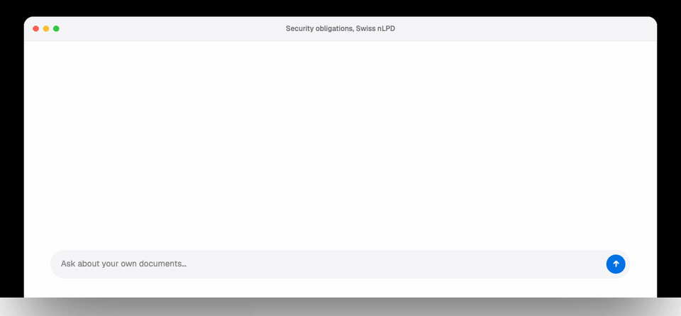
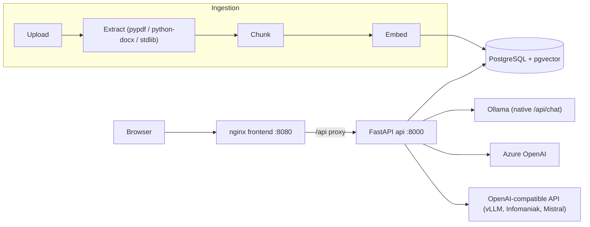

# sovereign-rag

> Retrieval-Augmented Generation that never has to leave your infrastructure.

sovereign-rag is a production-grade RAG template for organizations that cannot ship their documents
to someone else's cloud: FastAPI + PostgreSQL/pgvector hybrid retrieval (vector + full-text, fused
with Reciprocal Rank Fusion), streaming chat with per-answer source citations, and swappable
LLM/embedding providers behind typed Protocols. It runs fully on-premise by default (Ollama + local
embeddings) and switches to Azure OpenAI or any OpenAI-compatible endpoint with environment
variables only.

[](https://github.com/Leroy-Guillaume/sovereign-rag/actions/workflows/ci.yml)
[](LICENSE)
[](https://www.python.org)

<!-- ./assets/demo.gif inserted at end of Phase 1 -->
<!--  -->

## Why

- **Privacy-first.** The default profile keeps everything on your hardware: local LLM (Ollama),
  local embeddings (sentence-transformers), PostgreSQL with pgvector. No external API key, no
  outbound call, no document ever leaves your infrastructure.
- **Cloud-optional, not cloud-dependent.** The same code talks to Azure OpenAI or any
  OpenAI-compatible API (vLLM, Infomaniak AI Tools, Mistral) by flipping environment variables.
  Every provider block in `.env.example` is annotated `# data leaves your infra: yes/no`.
- **Built for regulated Swiss and EU organizations.** Every assistant answer stores an audit
  snapshot of the exact sources shown to the user (excerpt, fused score, per-leg ranks) that
  survives document deletion. See [COMPLIANCE.md](COMPLIANCE.md) for the ISO 27001 / nLPD / LIPAD
  mapping and the data-residency matrix per deployment profile.

## Architecture



Retrieval is a single SQL query: HNSW vector search and tri-language full-text search (French,
German, English) run as two CTEs and are fused with Reciprocal Rank Fusion inside PostgreSQL.
Design decisions and trade-offs are documented in [ARCHITECTURE.md](ARCHITECTURE.md).

## Quickstart

```bash
git clone https://github.com/Leroy-Guillaume/sovereign-rag.git
cd sovereign-rag
cp .env.example .env
docker compose up --build
```

Prebuilt images are also published to GHCR on every merge to main
(`ghcr.io/leroy-guillaume/sovereign-rag-api` and `-frontend`, tagged `latest`
and by commit sha).

Wait for the model pull to finish (first boot only), then:

1. Open http://localhost:8080
2. Sign in with the demo API key: `sk-demo` (`sk-demo-admin` grants the admin role)
3. Ask: *Quelles sont les obligations de sécurité selon la nLPD ?*

The answer streams in French and cites the seeded demo documents as `[1]`, `[2]`, …

If another PostgreSQL already owns port 5432 on your machine, set `POSTGRES_HOST_PORT` in `.env`:
the compose file publishes the database on `${POSTGRES_HOST_PORT:-5432}`.

> **Note: the first boot is not instant.** The one-shot `ollama-pull` service downloads
> `qwen3:4b-instruct` (~2.6 GB) on the first `docker compose up`. The API, document ingestion and search
> are available immediately; chat needs the pull to complete. The model is stored in a persistent
> volume, so the second boot is instant.

## Providers

Switch providers with environment variables only, never a code change. The compose `ollama` service
runs under the `ollama` compose profile (`COMPOSE_PROFILES=ollama` in `.env.example`); clear that
variable to disable it when using an external LLM.

| Provider | Config vars | Data leaves your infra |
| --- | --- | --- |
| `ollama` (LLM, default) | `LLM_PROVIDER=ollama`, `OLLAMA_BASE_URL`, `OLLAMA_MODEL`, `OLLAMA_KEEP_ALIVE`, `OLLAMA_THINK` | **No** |
| `azure_openai` (LLM) | `LLM_PROVIDER=azure_openai`, `AZURE_OPENAI_ENDPOINT`, `AZURE_OPENAI_API_KEY`, `AZURE_OPENAI_CHAT_DEPLOYMENT`, `AZURE_OPENAI_API_VERSION` | Yes, to your Azure tenant and region |
| `openai_compatible` (LLM) | `LLM_PROVIDER=openai_compatible`, `OPENAI_COMPAT_BASE_URL`, `OPENAI_COMPAT_API_KEY`, `OPENAI_COMPAT_MODEL` | Depends on the endpoint: no for self-hosted vLLM, yes for a hosted API |
| `local` (embeddings, default) | `EMBEDDING_PROVIDER=local`, `EMBEDDING_MODEL`, `EMBEDDING_DIMENSIONS` | **No** |
| `azure_openai` (embeddings) | `EMBEDDING_PROVIDER=azure_openai`, `AZURE_OPENAI_ENDPOINT`, `AZURE_OPENAI_API_KEY`, `AZURE_OPENAI_EMBEDDING_DEPLOYMENT` | Yes, to your Azure tenant and region |

Azure OpenAI with an API key works with the core install. Only keyless auth (managed identity,
Phase 4) needs the extra: `uv sync --extra azure`.

## Reranking

The compose stack enables a cross-encoder reranking stage
(`RERANKER_PROVIDER=local`): hybrid search over-fetches 40 fused candidates
and `cross-encoder/mmarco-mMiniLMv2-L12-H384-v1`, running in-process over ONNX
on CPU, keeps the 8 best. Measured on the evaluation corpus: hit@1 +6 points,
MRR 0.675 -> 0.717, for a median 144 ms per query. The weights are baked into
the API image, so the local profile stays fully offline. Set
`RERANKER_PROVIDER=none` to serve the fused order directly (the control arm
worth re-measuring against after any corpus change).

## Embedding model

> [!WARNING]
> **Embedding model versions are frozen deliberately.** Every vector in the index was produced by
> `intfloat/multilingual-e5-small` (384 dimensions). Switching models, or even changing a model
> version, silently invalidates the entire index: old and new vectors are not comparable. As a
> guard, the application refuses to boot when `EMBEDDING_MODEL` / `EMBEDDING_DIMENSIONS` do not
> match what the index was built with (the `embedding_config` table), and each document is stamped
> with the model that embedded it.

**Upgrading to `BAAI/bge-m3`** (better quality, 8k context window, but ~2.3 GB and a slower first boot):

1. Set three env vars: `EMBEDDING_PROVIDER=local`, `EMBEDDING_MODEL=BAAI/bge-m3`,
   `EMBEDDING_DIMENSIONS=1024`.
2. Add the next numbered migration (e.g. `backend/migrations/0002_upgrade_bge_m3.sql`) that
   changes `chunks.embedding` to `vector(1024)`, recreates the HNSW index, and updates the
   `embedding_config` row.
3. Re-ingest every document: embeddings cannot be converted. Delete and re-upload (or truncate
   `chunks` and `documents` and re-run the seed/uploads).

## Adding a vector store

pgvector is the only store implemented, and that is deliberate. The `VectorStore` Protocol
(`backend/src/sovereign_rag/store/base.py`) is the seam:

1. **Implement the Protocol**: `add_chunks`, `hybrid_search`, `delete_document`, `healthcheck`.
   `hybrid_search` returns `SearchHit` objects carrying the fused score and the per-leg ranks
   (`vec_rank`, `fts_rank`).
2. **Register it in the factory**: add your value to `vector_store: Literal["pgvector"]` in
   `backend/src/sovereign_rag/config.py`. Pyright immediately flags the now non-exhaustive
   `match` in `store/__init__.py` (`assert_never`); then add the lazy-import branch in
   `get_vector_store()`.
3. **Run the contract suite**: add your implementation as a fixture in
   `backend/tests/contract/test_vectorstore_contract.py`. It verifies stable ordering, that `k`
   is honored, and that mixed vector-only / text-only hits carry the right ranks.

Notes for the two most-requested targets (documented, not implemented):

- **Qdrant**: use the server-side hybrid Query API (native RRF fusion) and do not re-fuse in
  Python. Map `filename`, `section` and `page` into the point payload.
- **Azure AI Search**: use the built-in hybrid mode (vector + BM25, optional semantic ranking);
  fusion stays server-side. Store chunk metadata as index fields.

## Limitations

- **No OCR.** Scanned PDFs without a text layer fail ingestion with an explicit error message.
- **PDF tables are degraded.** pypdf flattens table layout to plain text; complex tables lose
  their structure.
- **Single-instance ingestion.** Uploads are processed in-process (asyncio task, no queue). A
  restart marks in-flight documents as `failed`; retry = delete + re-upload. The evolution path
  (jobs table + worker) is documented in [ARCHITECTURE.md](ARCHITECTURE.md).

## Roadmap

- **Phase 2**: audit log, document ACLs, PII-redaction seam (Presidio), admin dashboard
  (p50/p95 latency, token spend, top cited documents).
- **Phase 3**: retrieval and answer evaluation: golden dataset FR/DE/EN, recall@k, MRR,
  LLM-as-judge.
- **Phase 4**: Azure deployment profile (Terraform: network, private endpoints, managed
  identity).

Both images are plain OCI containers: the stack ports to AKS (or any Kubernetes) by externalizing
Postgres and secrets, with no code change required.

## License

Apache-2.0. See [LICENSE](LICENSE).
